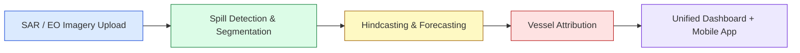
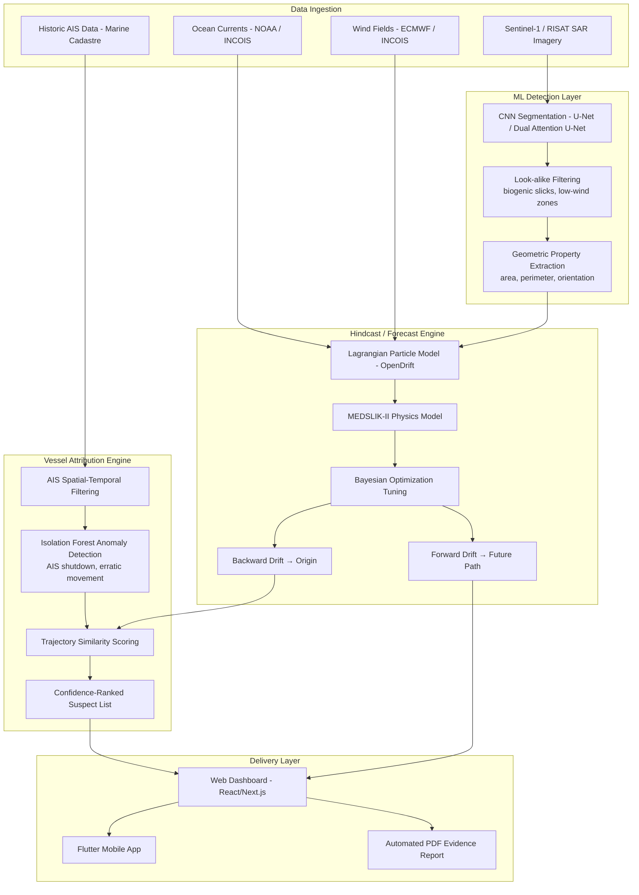
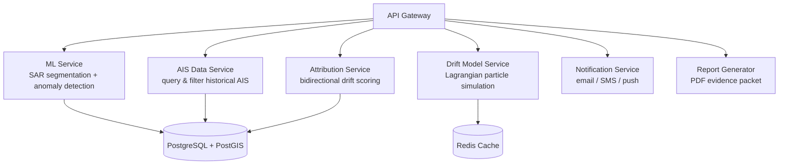
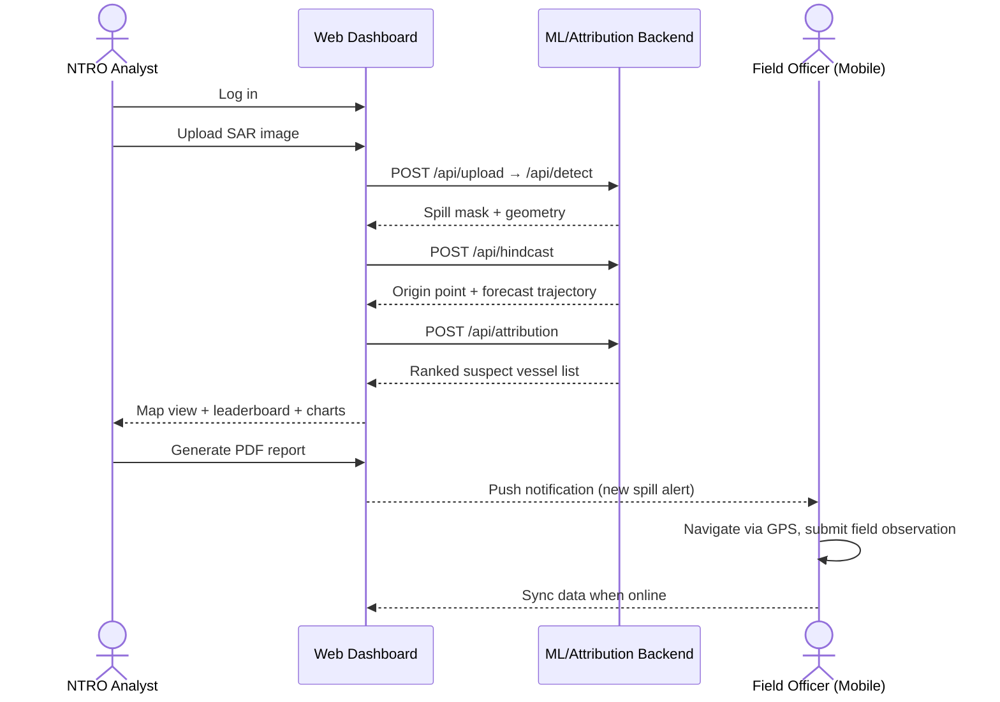

# Product Requirements Document (PRD)
## AI-Enabled Oil Spill Detection & Vessel Attribution Platform

**Smart India Hackathon 2026 — Problem Statement ID: 26143**
**Posed by:** National Technical Research Organisation (NTRO)
**Document Version:** 1.0
**Status:** Draft for SIH Submission

---

## 1. Executive Summary

### 1.1 Purpose

This document defines the requirements for an AI-enabled platform that detects oil spills from satellite imagery and attributes them to the responsible vessels using Automatic Identification System (AIS) data correlation. The platform addresses the critical challenge of un-attributable marine oil spills, which inflict severe damage on marine ecosystems while polluters often evade accountability.

> 📡 *Reference: satellite/SAR-based detection of oil slicks on open water — the same class of imagery this platform processes. See [NOAA's overview of satellite oil spill tracking](https://oceanservice.noaa.gov/news/) for example imagery.*

### 1.2 Product Vision

To build India's first integrated, intelligent platform that combines satellite remote sensing, oceanographic modeling, and vessel tracking data to provide actionable evidence for maritime pollution enforcement. The system will transform raw satellite imagery into a clear, court-admissible chain of evidence identifying the polluting vessel.

### 1.3 Target Users

| User Type | Description |
|---|---|
| **NTRO Analysts** | Primary users who upload satellite imagery and review detection results |
| **Maritime Enforcement** | Coast Guard, DG Shipping officials who act on attribution reports |
| **Environmental Agencies** | MoEFCC, CPCB officials monitoring marine pollution |
| **Field Officers** | Mobile app users for on-ground verification |

---

## 2. Problem Statement (As Defined by NTRO)

**Core Challenge:** Facilitate detection of oil spills and identification of polluting vessels using remote sensing satellite data (SAR and EO imagery) and AIS data.

**Key Deliverables:**
1. Detect and characterize oil spills, calculating geometric properties and age if feasible
2. Trace slick towards origin point and time using oceanographic/meteorological data
3. Predict future flow of the slick
4. Attribute the spill to a vessel using historic AIS data

---

## 3. System Architecture & Pipeline

### 3.1 High-Level Pipeline

### 3.2 Detailed Data Flow

### 3.3 Reference Imagery Context

For visual references of the kind of output/visualization each module should produce (not literal platform screenshots — these are external sources for your team's own research/inspiration):

| Data Type | Reference |
|---|---|
| AIS vessel tracking (live global map) | [MarineTraffic — Live Ship Map](https://www.marinetraffic.com/) |
| Oil drift / trajectory modeling | [Frontiers in Marine Science — Oil Trajectory & Fate Modeling](https://www.frontiersin.org/articles/10.3389/fmars.2021.577013/full) |
| SAR oil spill segmentation examples | [Zenodo — Sentinel-1 SAR Oil Spill Dataset](https://zenodo.org/) |

> Note: I embedded hotlinked images from search results in the first draft, but those URLs point to third-party CDN/blob storage that doesn't stay reachable outside the search context (that's why you saw the BlobNotFound XML error). Linking out to the source pages above is more reliable for a document you'll keep and share.

---

## 4. Functional Requirements

### 4.1 Module 1 — SAR Imagery Input & Processing

- Accept SAR satellite imagery uploads (Sentinel-1, RISAT, etc.) via web interface
- Supported formats: GeoTIFF, PNG, JPEG
- Automatic oil spill detection using CNN-based segmentation models
- Distinguish oil spills from "look-alikes" (biogenic slicks, low-wind areas)
- Calculate geometric properties: area, perimeter, shape, orientation

**Technical Notes:** U-Net or Dual Attention U-Net architecture recommended; pre-trained models can be fine-tuned on the Zenodo Sentinel-1 SAR Oil Spill dataset.

### 4.2 Module 2 — AIS Data Integration

- Ingest and store historical AIS data for Indian coastal waters (source: `marinecadastre.gov/accessais/`)
- Parse AIS messages: MMSI, timestamp, lat/long, speed, course, vessel type
- Filter AIS data spatially and temporally based on spill location/time window
- Identify anomalous vessel behavior (erratic movement, transponder shutdown)

**Technical Notes:** Isolation Forest for anomaly detection; AIS messages include VHF Data Link Signal Information (signal strength, SNR) for enhanced tracking.

### 4.3 Module 3 — Hindcasting & Drift Modeling

- **Backward Drift:** trace the slick backward in time using ocean current/wind data to estimate origin point and time
- **Forward Drift:** predict future trajectory for emergency response
- Incorporate oceanographic data: sea surface currents (NOAA/INCOIS), wind fields
- Hybrid approach: physics-based MEDSLIK-II model + AI optimization (target: up to 20% improvement in spatial prediction accuracy)

**Technical Notes:** OpenDrift framework recommended; Bayesian optimization to auto-tune physical parameters from satellite observations.

### 4.4 Module 4 — Vessel Attribution & Scoring

- Convert oil spill area into trajectory points
- Compute similarity between backward-drift results and forward drift of candidate vessels
- Scoring parameters:
  - **Proximity** — distance from vessel track to spill origin at discharge time
  - **Trajectory** — similarity between vessel path and drift model results
  - **Behavioral Anomalies** — AIS shutdown, speed/heading changes, route deviation
- Rank suspect vessels with confidence scores; remain effective in heavy-traffic areas

**Technical Notes:** Bidirectional drift model addresses "many-to-one" tracing challenges in high-traffic zones — solves the limitation of one-way (backtrack-only or forward-only) models.

### 4.5 Module 5 — Web Dashboard

- Interactive map: detected spill overlay, hindcasted origin/path, forecasted drift, suspect vessel tracks
- Data visualization: time-series spill progression, vessel leaderboard, compliance/risk metrics
- Automated alert generation for high-risk detections
- One-click PDF report generation (spill summary, suspect vessels, evidence)
- User authentication and role-based access

**Technical Notes:** Real-time updates via WebSockets; map library — Leaflet, Mapbox GL, or Google Maps API.

### 4.6 Module 6 — Mobile Application (Flutter)

- Cross-platform (Android & iOS)
- Map view for field officers to view spill locations
- Offline support: log observations, sync when online
- Push notifications for new spill alerts
- Form submission with photo attachments and GPS location tagging

**Technical Notes:** Flutter framework; Google Maps Flutter or Mapbox Flutter; SQLite for offline local storage.

---

## 5. Non-Functional Requirements

| Requirement | Specification |
|---|---|
| **Performance** | API response time < 3s for AIS queries; ML inference < 30s |
| **Scalability** | Deployable across multiple coastal regions and maritime zones |
| **Availability** | 99.5% uptime for critical monitoring functions |
| **Security** | Role-based access; data encryption at rest and in transit |
| **Offline Support** | Mobile app functions without internet for field data collection |
| **Multi-language** | Dashboard and mobile app support multilingual interfaces |

---

## 6. Data Sources

### 6.1 Primary Data Sources

| Data Type | Source | Format |
|---|---|---|
| SAR Imagery | Copernicus Open Access Hub (Sentinel-1), RISAT | GeoTIFF, GRD products |
| AIS Data | Marine Cadastre (marinecadastre.gov) | NMEA, CSV |
| Ocean Currents | NOAA, INCOIS | NetCDF, GRIB |
| Wind Data | ECMWF, INCOIS | NetCDF, GRIB |

### 6.2 Datasets for Development

- **Zenodo Sentinel-1 SAR Oil Spill Dataset** — 310 pre-processed images (1250×650×3 px) containing oil spills, look-alikes, ships, land, sea
- **AIS Sample Data** — available from `marinecadastre.gov/accessais/`

---

## 7. Technical Architecture

### 7.1 Recommended Tech Stack

| Layer | Technology |
|---|---|
| Backend API | Python + FastAPI / Flask |
| ML Framework | PyTorch / TensorFlow |
| Database | PostgreSQL + PostGIS |
| Vector Search | pgvector (trajectory similarity) |
| Cache | Redis |
| Web Frontend | React / Next.js |
| Mobile App | Flutter |
| Map Visualization | Mapbox GL / Leaflet |
| Deployment | Docker, AWS / Azure / GCP |

### 7.2 System Components

### 7.3 API Endpoints

| Endpoint | Method | Purpose |
|---|---|---|
| `/api/upload` | POST | Upload SAR image for analysis |
| `/api/detect` | POST | Run spill detection on uploaded image |
| `/api/hindcast` | POST | Run backward and forward drift modeling |
| `/api/attribution` | POST | Score and rank suspect vessels |
| `/api/report/{id}` | GET | Generate PDF report for incident |
| `/api/alerts` | GET | Retrieve active alerts |

---

## 8. User Flows

### 8.1 Core Flow — End-to-End Analysis

### 8.2 Mobile App Flow

1. Field officer opens app
2. Views active spills on map (or offline cached data)
3. Receives push notification for new detection
4. Navigates to location using GPS
5. Submits observation with photos and notes
6. Data syncs when back online

---

## 9. Success Criteria

### 9.1 Minimum Viable Product (MVP) for SIH Demo

- [x] SAR image upload and basic detection
- [x] AIS data parsing and spatial filtering
- [x] Simplified hindcasting using pre-computed drift data
- [x] Vessel scoring algorithm demonstration
- [x] Functional web dashboard with map and charts
- [x] Flutter mobile app with map view
- [x] Working end-to-end pipeline for a single scenario

### 9.2 Stretch Goals (Differentiators)

- [ ] Animated spill simulation on map
- [ ] Automated PDF report generation
- [ ] Push notifications on mobile app
- [ ] Offline support for mobile app
- [ ] Real-time API updates via WebSockets
- [ ] Multilingual support

---

## 10. Risks and Mitigation

| Risk | Impact | Mitigation |
|---|---|---|
| Model accuracy | False positives/negatives | Train on diverse datasets; include confidence scores; hybrid detection approaches |
| Data availability | Cannot test with real data | Use sample AIS data from Marine Cadastre + Zenodo SAR dataset |
| Integration complexity | Pipeline fails end-to-end | Define API contracts first; mock APIs for frontend development |
| Time constraints | Cannot build all modules | Pre-build core modules before hackathon; focus on integrated demo |
| Offline support | Mobile app unusable in field | Implement SQLite local storage; queue sync mechanism |

---

## 11. References

1. Luo, D., Chen, P., Yang, J., et al. (2024). "A new ship tracing technology from oil spills based on multi-source data." *Marine Pollution Bulletin*, 207.
2. Singh, M., Kaur, S., Mishra, A. (2025). "AIS-driven smart oil spill detection for maritime safety." Taylor & Francis.
3. Anjum, A., Tabassum, H., et al. (2025). "A Real Time Oil Spill Detection Using Deep Learning and Automatic Identification System." IEEE ICAICCIT.
4. "Improving oil slick trajectory simulations with Bayesian optimization." *Ecological Informatics*, 2025.
5. CMCC Research (2025). "Oil Spill Response Potential Enhanced with AI-Powered Prediction." ECO Magazine.
6. "Applying an improved object detection algorithm for operational oil spill detection and tracking." *Marine Pollution Bulletin*, 2025.

---

*Document prepared for Smart India Hackathon 2026 — Problem Statement 26143 (NTRO).*